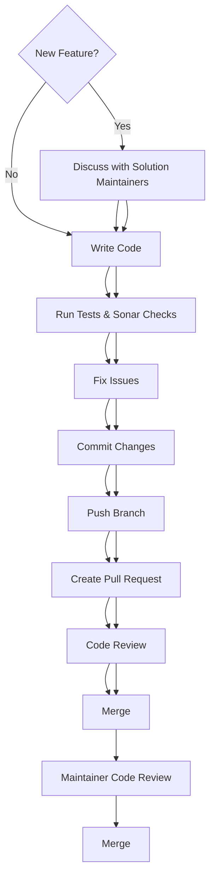
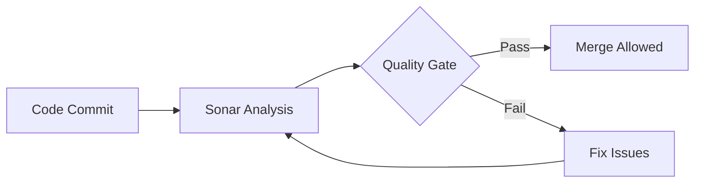
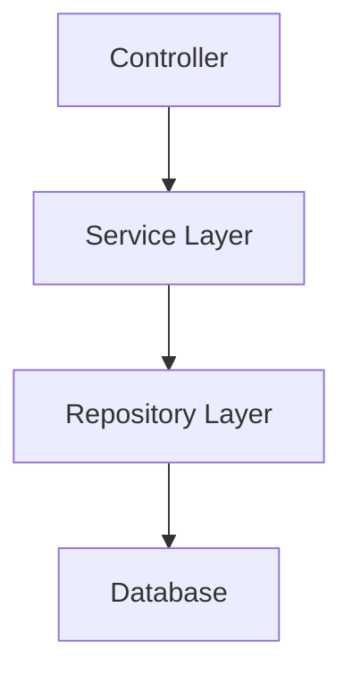
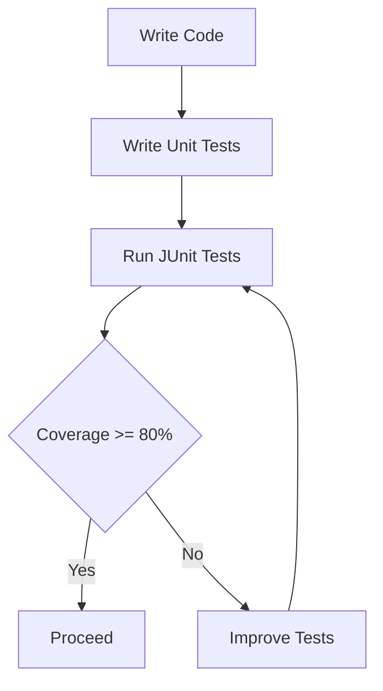
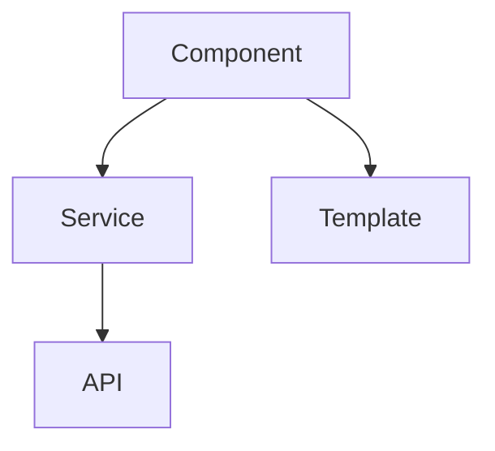
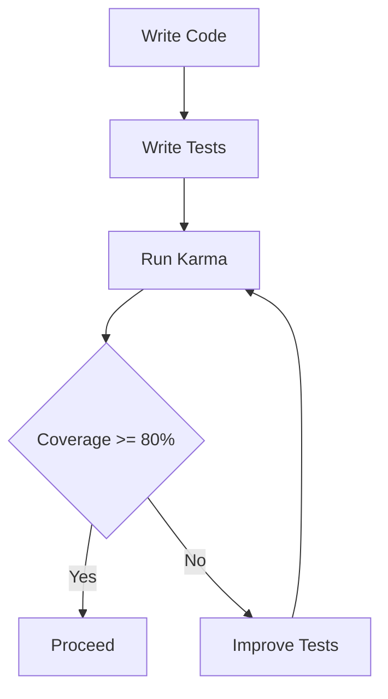
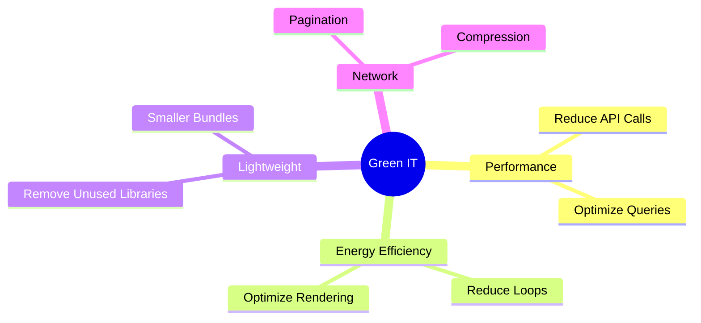
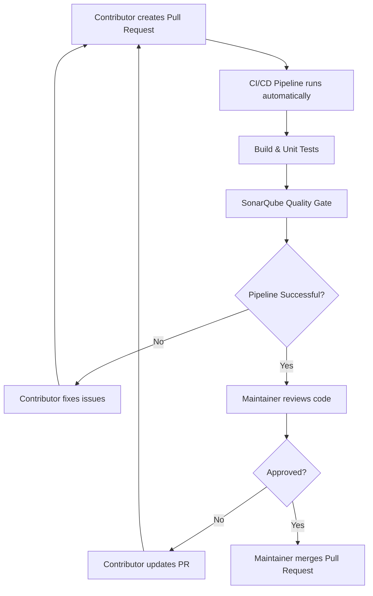

# 🌱 Contribution Guidelines

Welcome! 👋
This project is built with a strong focus on **Green IT** and **Eco-design principles** to help reduce **carbon emissions** through efficient and sustainable software development.

---

## 💡 Before You Start

For **new features**, please discuss your proposal with the **Solution Maintainers** before starting development.

This discussion helps ensure that:

- The feature provides value to the project and its users.
- It aligns with the project's functional roadmap and priorities.
- The proposed implementation fits the existing architecture and design.
- Similar work is not already planned or in progress.

Bug fixes, documentation improvements, and small enhancements generally do not require prior discussion unless they significantly impact the application's behavior.

---

## 📌 Contribution Workflow

### Steps:

1. **For new features**, discuss the proposal with the Solution Maintainers to validate its value and alignment with the project roadmap.
2. Fork the repository
3. Create a new branch
   `feat/your-feature-name`
   `fix/bugfix-name`
4. Follow coding standards described below
5. Validate your changes locally
   - Run unit tests
   - Ensure the project builds successfully
   - Run any available local static analysis
6. Push your branch and create a Pull Request

> **Note:** SonarQube Quality Gate validation is executed automatically by the CI/CD pipeline after a Pull Request is created. See the **CI/CD Validation (SonarQube & Quality Gate)** section below for details.

---

## 🧹 Code Quality Standards

* Follow **Clean Code principles**
* Avoid duplication
* Write **modular and reusable code**
* Use meaningful naming conventions
* Remove unused code

---

## 🔍 CI/CD Validation (SonarQube & Quality Gate)

After a Pull Request is opened, the CI/CD pipeline automatically builds the project, executes unit tests, performs SonarQube analysis and validates the Quality Gate.

### ✅ Required:

* No **Blocker / Critical issues**
* Code Coverage ≥ **80%**
* No major code smells
* No security vulnerabilities
* Low duplication

---

## ☕ Backend Guidelines (Java)

### Rules:

### Java & Spring Boot Best Practices

- Follow the coding conventions already established in the project.
- Keep controllers lightweight and delegate business logic to services.
- Use constructor injection instead of field injection.
- Validate request inputs.
- Use DTOs instead of exposing JPA entities.
- Handle exceptions through the global exception handler.
- Use SLF4J logging instead of `System.out.println`.
- Avoid hardcoded configuration values.
- Keep methods small, readable and testable.
- Write unit tests for new business logic.

### Additional Rules
* Generate DTOs using Source Code Generator (Open-API)
* Proper exception handling
* Avoid hardcoding
* Use logging (not `System.out.println`)
* Optimize queries

---

## Unit Testing (JUnit & Mockito)

### Guidelines

* Use JUnit 5 for writing test cases.
* Use Mockito for mocking dependencies.
* Follow the Arrange–Act–Assert (AAA) pattern.
* Keep tests independent and isolated.
* Mock external services, databases, and APIs.
* Aim for at least 80% code coverage.

---

## 🅰️ Frontend Guidelines (Angular)

### Rules:

* Use **standalone components**
* Avoid heavy logic in templates
* Use services for business logic
* Enable lazy loading

---

## 🧪 Unit Testing (Jasmine & Karma)

### Guidelines:

* Cover components, services
* Use mocks for dependencies
* Avoid testing implementation details

---

## 🌍 Green IT & Eco-Design Principles

### Follow:

* Optimize performance ⚡
* Reduce memory usage
* Minimize API/data transfer
* Avoid unnecessary computations

---

## 🔁 Pull Request Process

After a Pull Request is created, the automated CI/CD pipeline validates the contribution. Once all checks pass, a project maintainer reviews the changes before merging them into the main branch.

### Responsibilities

| Step | Contributor | Maintainer |
|---|:---:|:---:|
| Create feature branch | ✅ | |
| Implement changes | ✅ | |
| Run local validation | ✅ | |
| Open Pull Request | ✅ | |
| CI/CD execution | Automatic | |
| SonarQube validation | Automatic | |
| Code Review | | ✅ |
| Approve / Request changes | | ✅ |
| Merge Pull Request | | ✅ |

### PR Checklist

* ✔ Project builds successfully locally
* ✔ Unit tests added or updated
* ✔ Documentation updated (if required)
* ✔ CI/CD pipeline passes
* ✔ Sonar Quality Gate passes
* ✔ Pull Request approved by a maintainer

## 🔎 Code Review Checklist

* Code readability
* Performance impact
* Green IT compliance
* Test coverage
* Security checks

---

## ❌ What to Avoid

* Large PRs
* Unused code
* Console logs
* Hardcoded values
* Ignoring Sonar issues

---

## 💡 Final Note

Every contribution should:

* Improve **code quality**
* Reduce **carbon footprint**
* Follow **eco-design principles**

🌱 *Let’s build sustainable software together!*
