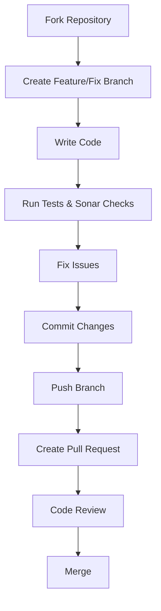
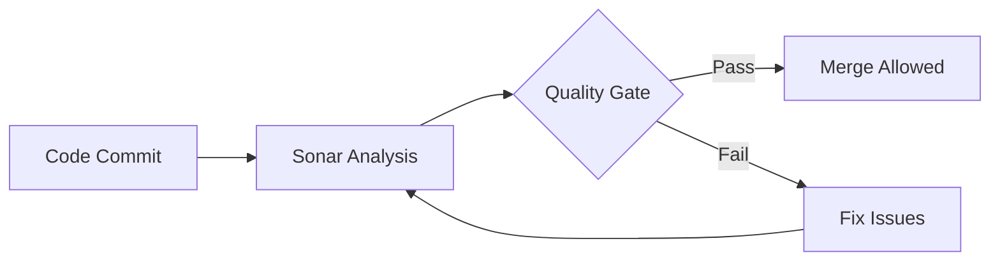
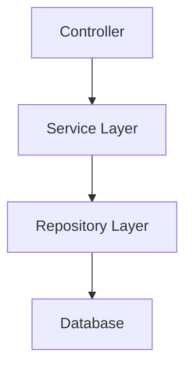
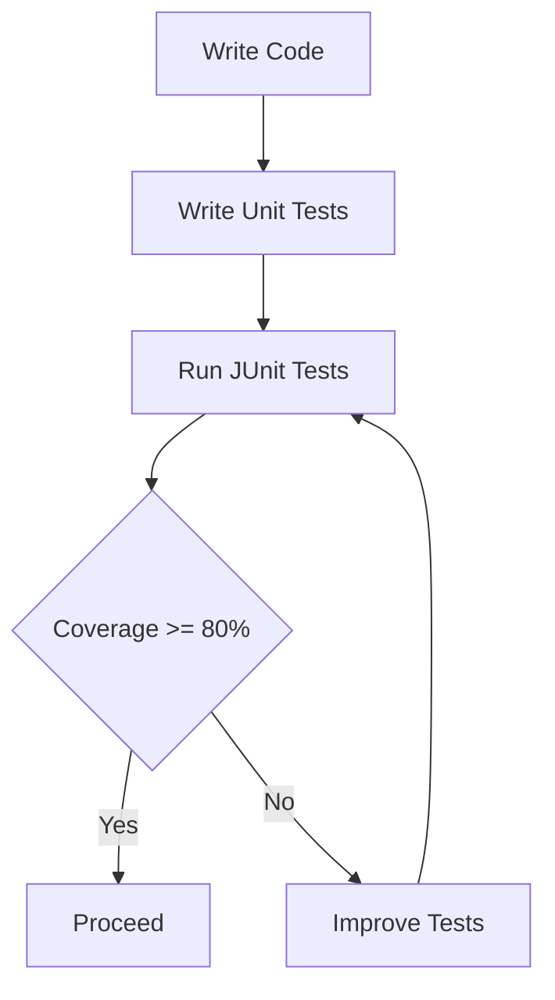
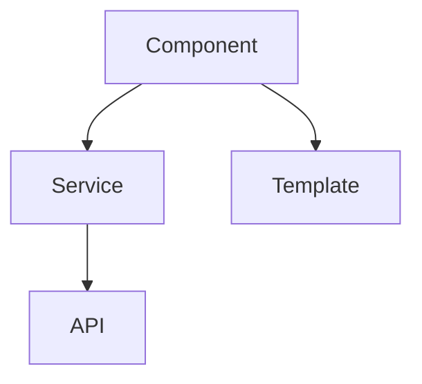
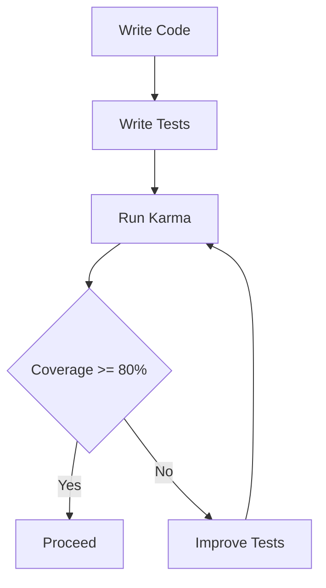
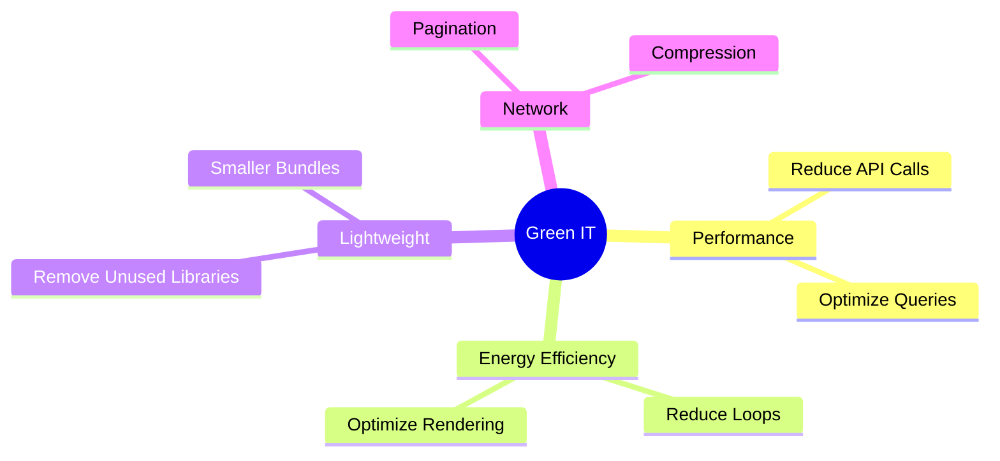
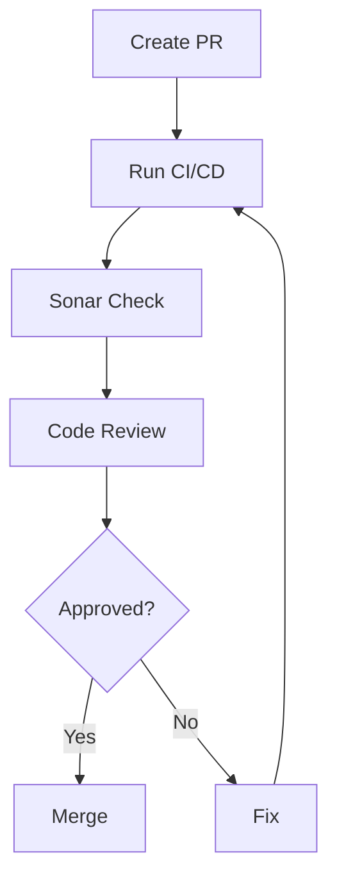

# 🌱 Contribution Guidelines

Welcome! 👋
This project is built with a strong focus on **Green IT** and **Eco-design principles** to help reduce **carbon emissions** through efficient and sustainable software development.

---

## 📌 Contribution Workflow

### Steps:

1. Fork the repository
2. Create a new branch
   `feat/your-feature-name`
   `fix/bugfix-name`
3. Follow coding standards given below
4. Run tests and Sonar checks
5. Push and create PR

---

## 🧹 Code Quality Standards

* Follow **Clean Code principles**
* Avoid duplication
* Write **modular and reusable code**
* Use meaningful naming conventions
* Remove unused code

---

## 🔍 SonarQube & Quality Gate

### ✅ Required:

* No **Blocker / Critical issues**
* Code Coverage ≥ **80%**
* No major code smells
* No security vulnerabilities
* Low duplication

---

## ☕ Backend Guidelines (Java)

### Rules:

* Follow **Java & Spring Boot best practices**
* Generate DTOs using Source Code Generator (Open-API)
* Proper exception handling
* Avoid hardcoding
* Use logging (not `System.out.println`)
* Optimize queries

---

## Unit Testing (JUnit & Mockito)

### Guidelines

* Use JUnit 5 for writing test cases.
* Use Mockito for mocking dependencies.
* Follow the Arrange–Act–Assert (AAA) pattern.
* Keep tests independent and isolated.
* Mock external services, databases, and APIs.
* Aim for at least 80% code coverage.

---

## 🅰️ Frontend Guidelines (Angular)

### Rules:

* Use **standalone components**
* Avoid heavy logic in templates
* Use services for business logic
* Enable lazy loading

---

## 🧪 Unit Testing (Jasmine & Karma)

### Guidelines:

* Cover components, services
* Use mocks for dependencies
* Avoid testing implementation details

---

## 🌍 Green IT & Eco-Design Principles

### Follow:

* Optimize performance ⚡
* Reduce memory usage
* Minimize API/data transfer
* Avoid unnecessary computations

---

## 🔁 Pull Request Process

### PR Checklist:

* ✔ Code follows standards
* ✔ Tests added
* ✔ Sonar passed
* ✔ Proper documentation

---

## 🔎 Code Review Checklist

* Code readability
* Performance impact
* Green IT compliance
* Test coverage
* Security checks

---

## ❌ What to Avoid

* Large PRs
* Unused code
* Console logs
* Hardcoded values
* Ignoring Sonar issues

---

## 💡 Final Note

Every contribution should:

* Improve **code quality**
* Reduce **carbon footprint**
* Follow **eco-design principles**

🌱 *Let’s build sustainable software together!*
