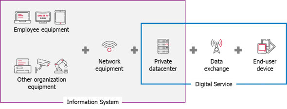

<!-- TOC -->

-   [Data Collected](#data-collected)
-   [Datacenter](#datacenter)
    -   [Data That Affects the Impact](#data-that-affects-the-impact)
    -   [Data for Informational Purposes](#data-for-informational-purposes)
-   [Physical Equipment](#physical-equipment)
    -   [Data That Affects the Impact](#data-that-affects-the-impact-1)
    -   [Data for Informational Purposes](#data-for-informational-purposes-1)
    -   [For Equipment in a Datacenter](#for-equipment-in-a-datacenter)
-   [Virtual Equipment](#virtual-equipment)
    -   [Hosting Under Control](#hosting-under-control)
        -   [Allocation Calculation](#allocation-calculation)
        -   [Notes](#notes)
    -   [Data for Informational Purposes](#data-for-informational-purposes-2)
    -   [Hosting Unknown – Cloud Services (IaaS)](#hosting-unknown--cloud-services-iaas)
-   [Application Infrastructure](#application-infrastructure) \* [Data for Informational Purposes](#data-for-informational-purposes-3)
<!-- TOC -->

## Data Collected

G4IT requires four main types of data:

-   **Datacenter**: Provides information about the energy efficiency of the data center.
-   **Physical Equipment**: The foundation of every IT system.
-   **Virtual Equipment**: Represents logical units or segments of physical infrastructure, essential for application
    impact assessment.
-   **Application**: Comprised of one or more virtual resources.

Each data type can be imported independently, multiple times, and supports automation via API.

Some of this data directly affects impact calculations, while other data is used for categorization and user interface
clarity. Find below details for each type of data.

---

## Datacenter

### Data That Affects the Impact

-   **Location**  
    The country or region where the datacenter is located.

-   **Power Usage Effectiveness (PUE)**  
    A measure of energy efficiency of the datacenter. The closer the value is to 1, the more efficient the datacenter. This indicator compare total facility power to IT
    equipment power.

### Data for Informational Purposes

-   **Entity**  
    The name of the organizational unit responsible for the equipment.

---

## Physical Equipment

### Data That Affects the Impact

-   **Equipment Characteristics**  
    Includes server model, CPU type, RAM, storage, etc.

-   **Quantity**  
    Number of identical equipment units.

-   **Lifespan** (if known)  
    Expected operational life of the equipment. 1st life (in case of refurbishment) and 3rd life (beyond the period of use within the organization) can be considered if justified

-   **Energy Consumption** (if known)  
    Yearly energy use in kilowatt-hours (kWh).

-   **Location**  
    The country where the equipment is most commonly used.

### Data for Informational Purposes

-   **Status**  
    Indicates whether the equipment is in use, in storage, in transit, etc.

-   **Entity**  
    The responsible organizational unit.

### For Equipment in a Datacenter

-   **Associated Datacenter**  
    Specifies the datacenter hosting the equipment.

---

## Virtual Equipment

Virtual Equipment in G4IT includes any virtual or logical infrastructure component necessary for application operation (
e.g., VMs, Pods, containers, routers).

### Hosting Under Control

When the underlying physical equipment is known and managed internally:

#### Allocation Calculation

-   **Compute Servers**:  
    Allocation = vCPUs used by this Virtual Equipment (will be divided by total vCPUs on the physical host).

-   **Storage Servers**:  
    Allocation = storage capacity used by this Virtual Equipment (will be divided by total storage on the physical host).

-   **Default Allocation**:  
    If data is missing, assume equal distribution among all Virtual Equipment.

-   **Custom Allocation Factor**:  
    User-defined values override automatic calculations.

#### Notes

1. a Clusters can be consider as a sum of physical resources.
2. In dynamic environments (for example in a containerized environment), allocate based on actual usage when possible, using Custom Allocation Factor.
3. Private cloud resources are considered "owned" once allocated — even if unused.
4. Developer laptops can be modeled as Virtual Equipment in proportion to their use during the development phases.
5. Dedicated application servers should be treated as 100% allocated Virtual Equipment.

### Data for Informational Purposes

-   **Entity**  
    The responsible organizational unit.

---

### Hosting Unknown – Cloud Services (IaaS)

When infrastructure details are abstracted (e.g., public cloud services):

-   **Cloud Provider**  
    e.g., AWS, Microsoft Azure, Scaleway, Google Cloud Platform(GCP).

-   **Subscription Details**:

    -   **Instance Type**  
        e.g., AWS t3.large, Azure D-series, Scaleway coparm1-16c-64g, GCP c4a-standard-1.
    -   **Location**  
        Geographical region of the cloud instance.

-   **Usage Metrics**:
    -   **Operating Time**  
        Duration the instance is running.
    -   **Average Workload**  
        Percentage of compute capacity used.

---

## Application Infrastructure

In G4IT, an application is defined as a group of Virtual Equipment.

### Data for Informational Purposes

-   **Environment Type**  
    Categorizes environments (e.g., production, development, staging).

-   **Domain** and **Subdomain**  
    Helps organize and group applications in the GUI.

---

[Detailed documentation about the module](../../../../2-functional-documentation/use_cases/uc_inventory/_index.md)
