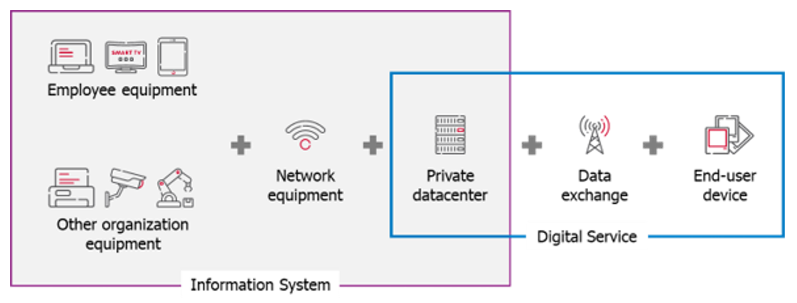

## Overview

A fascinating chapter 💥 to get started with the application.

## Table of contents
<!-- TOC -->
  * [Overview](#overview)
  * [Table of contents](#table-of-contents)
  * [What is G4IT?](#what-is-g4it)
  * [Why use G4IT?](#why-use-g4it)
  * [Who can use G4IT?](#who-can-use-g4it)
  * [How to use G4IT?](#how-to-use-g4it)
  * [Available modules in G4IT](#available-modules-in-g4it)
<!-- TOC -->

## What is G4IT?
G4IT is a platform that facilitates the assessment, definition and management of plans to reduce the impact of digital technology at an organizational scale.

**Simple** : Accessible from a web browser, making it widely usable within an organization, without technical skills or installation  
**Standard** : Based on NumEcoEval, the benchmark calculation engine built with the French Ministry of Ecological Transition, and the work of leading organizations

## Why use G4IT?
* To evaluate, improve and control your environment impact
* To put the organization and its employees into action as part of a transition process
* To minimize impact to contribute to the collective effort needed for the future, we can all look forward to.

## Who can use G4IT?
G4IT is a tool for organizational decision-making :
* For General Management, which must set the course by positioning long-term goals
* For the IT Department (managed by Sustainable Digital Referent) who is responsible for the operational management of IT impact reduction
* For the CFO, who reports annually on his footprint within an increasingly restrictive regulatory framework
* For the Project Manager, who reports his footprint for the digital services

## How to use G4IT?
G4IT supports you all along the measurement processes from inventory data collection to indicators analysis.
* **IMPORT** : Collect data of the items that are part your IS and import them in a centralized view
* **ESTIMATE** : Estimate multi-criteria environmental footprint of your IS and Digital Services
* **VISUALIZE** : Visualize multi-criteria environmental footprint of your IS through preconfigured dashboards
* **EXTRACT** : Extract impact indicators for ad-hoc analysis in your own BI system
* **EVALUATE** : Evaluate environmental footprint of digital services, project teams or technical configuration to enlighten a decision-making process

## Available modules in G4IT

There are three available modules:

{}

