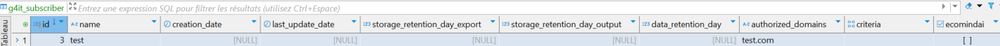

### Default behavior

By default, Ecomind module is disabled for all organizations, so it is not accessible at all (frontend and backend) for all organizations and users.

You have to enable it manually for each organization.

To do so, a new column has been added to the **g4it_subscriber** table (refers to the Organization).

This column is called **ecomindai** and is false by default. This column can only be edited via the database.

### How to enable Ecomind for an organization ?

To enable Ecomind for an organization you have to do it manually via the database.

To do so, you need to change the value of the "ecomindai" column of the g4it_subscriber table.

Here the ecomindai column isn't checked meaning the Ecomind module is disabled for the organization test.

Now the ecomindai column is checked meaning the Ecomind module is enabled for the organization test.

