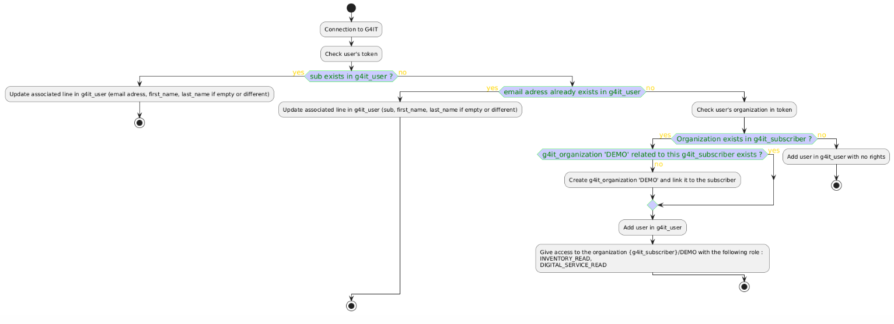

## Table of contents
-   [Activity Diagram](#activity-diagram)
-   [Session Expiration Handling](#session-expiration-handling)
{}

## Activity Diagram

## Session Expiration Handling

- Added handling for unauthorized (401) error code responses when Keycloak authentication is enabled and keycloak token is expired.
- If the user's Keycloak access token has expired, the application automatically redirects the user to the Keycloak login page.
- After successful authentication, the user is returned to the current application URL.
- If the unauthorized response is not caused by an expired Keycloak session, the application navigates to the appropriate error page.
