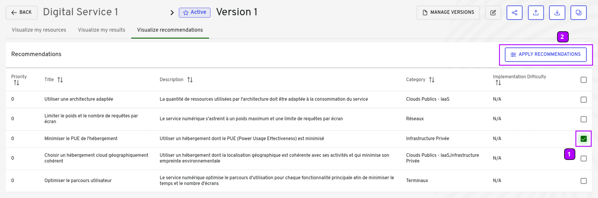
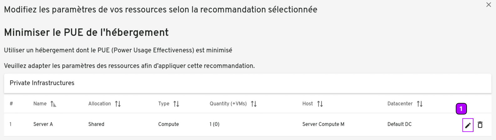
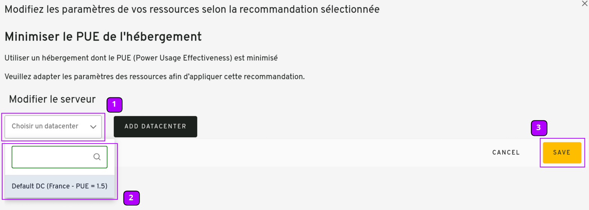

## Table of contents

-   [Table of contents](#table-of-contents)
-   [Description](#description)
-   [State Diagram](#state-diagram)
-   [Global view](#global-view)
-   [Sequence Diagram](#sequence-diagram)

## Description

This use case allows a user to visualize possible way to impove their digital service throught diffrent recommandtations.
Recommandations are sorted by estimated impact on the digital service, and are organizations based.
User can also create a new version of a digital service implemtenting different recommandations, and the compare it with the orgininal (see [2.11. Compare two digital service versions](uc11_compare_two_versions)).

User can select recommandations to simulate using a checkbox column. User can apply selected recommandations by modifing corresponding deigital service ressources. A new digital service version is created.

## State Diagram


graph TD;

    Step1[Digital Service Version view] --> Decision1{First Calculation is done?}
    
    Decision1-->|Yes|Step2[Tab 'Visualize recommandations' is enabled]
    
    Decision1-->|No|Step3[Tab 'Visualize recommandations' is not enabled]
    
    Step2-->Step3[Click on 'Visualize recommandations' button] 
    
    Step3-->Step4[All recommandations about a digital service are displayed]
    
    Step4-->Step5[Select all recommandations to simulate]
    
    Step5-->Step6[Click on a 'Apply recommandation' button]
    
    Step6-->Step7[For Each recommandation, modify digital service value]
    
    Step7-->Step7
    
    Step7-->Setp8[A new version of the digi tal service is created and can be compare with the original one]
    


## Global view

-   **Select recommandation to simulate**
    

{}

| Reference | Group       | Elements          | Type   | Description                                                       |
|-----------|-------------|-------------------|--------|-------------------------------------------------------------------|
| 1         |             | Recommandations      | label  | Selected recommandation to simulate                   |
| 2         |             | Apply recommandations | button | Click on the apply recommandations button to apply open the modifications window. |

{}

-   **Select digital service attribut to modify**
    

{}

| Reference | Group       | Elements          | Type   | Description                                                       |
|-----------|-------------|-------------------|--------|-------------------------------------------------------------------|
| 1         |             | Modify Button | button | Click on the modify button to modify the ressources. |

{}

-   **Modify selected attribut**
    

{}

| Reference | Group       | Elements          | Type   | Description                                                       |
|-----------|-------------|-------------------|--------|-------------------------------------------------------------------|
| 1         |             | Ressource button      | button  | Click on the ressource boutton to modify the ressource.                    |
| 2         |             | Ressource | Dropdown | Click on the new value of the ressource. |
| 3         |             | Save      | button  | Click on the Ssave button to save modifications            |

{}

## Sequence Diagram


sequenceDiagram
actor RND as Project Team
participant front as G4IT Front-End
participant back as G4IT Back-End
participant DataBase

RND -->> front: Click on Vizualize recommandations
front -->> back: GET `tbd`
back -->> DataBase: fetch all recommandations related to digital service id of digital service version
back -->> front: return all recommandations sorted by relevance
RND -->> front: Select recommandation and click on Apply recommandation
front -->> back POST `tbd`
back -->> DataBase: Create new digital service version with modifications
back -->> front: return all digital service version
front -->> RND: Display all digital service version


