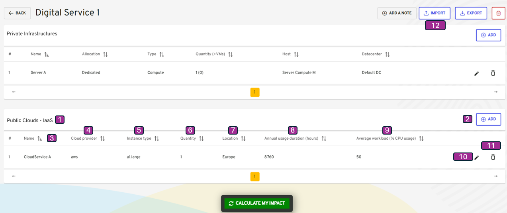
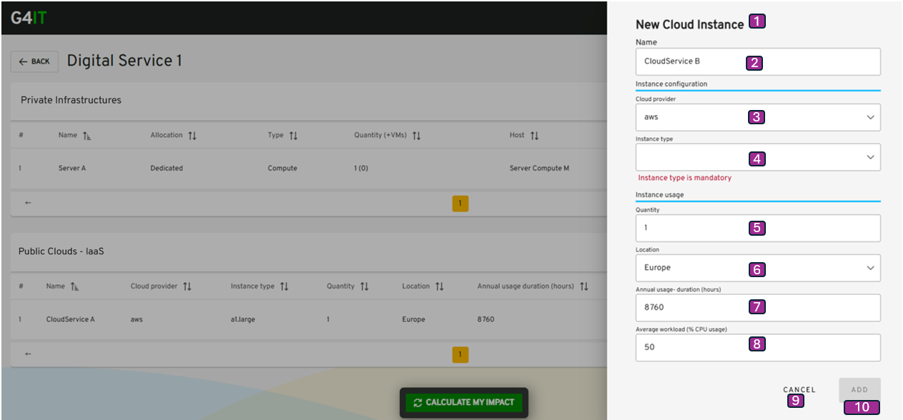

-   [Table of contents](#table-of-contents)
-   [Description](#description)
-   [Public Cloud - IaaS visualization](#public-cloud---iaas-visualization)
-   [Public Cloud - IaaS add](#public-cloud---iaas-add)
-   [Public Cloud - IaaS edit](#public-cloud---iaas-edit)

## Description

This use case allows a project team to add Public Cloud - IaaS equipment directly via form, into a digital service version previously created.

**Navigation Path**

-   My Digital Services / My Digital Service view / Visualize my resources tab / Public Clouds - IaaS

**Access Conditions**
The connected user must have the write access for that module on the selected workspace.

## Public Cloud - IaaS visualization

{}

| Reference | Group                | Elements            | Type                           | Description                                                                                                                                                                               |
|-----------|----------------------|---------------------|--------------------------------|-------------------------------------------------------------------------------------------------------------------------------------------------------------------------------------------|
|           | Tab Header           | Visualize my resources| Tab                            |                                                                                                                                                                                           |
| 1         | Public Clouds - IaaS |       | table                          |                                                                                                                                                                                           |
| 2         |                      | + Add| button                         | <li><u>_initialization rules_</u>: That button is displayed if the connected user have the write right.  <li><u>_action rules_</u>: That button open the window Device details.  |
|           | Tab                  |                     |                                |                                                                                                                                                                                           |
| 3         |                      | Name                | column                         |                                                                                                                                                                                           |
| 4         |                      |                     | Cloud provider                 | dropdown                                                                                                                                                                                  |                                                                                                                   |
| 5         |                      |                     | Instance type                  | dropdown                                                                                                                                                                                  |                                                                                                                   |
|           |                      | Instance usage      |                                | section                                                                                                                                                                                   |                                                                                                                   |
| 6         |                      |                     | Quantity                       | Entire number input                                                                                                                                                                       |                                                                                                                   |
| 7         |                      |                     | Location                       | dropdown                                                                                                                                                                                  |                                                                                                                   |
| 8         |                      |                     | Annual usage duration (hour)   | Entire number input                                                                                                                                                                       |                                                                                                                   |
| 9         |                      |                     | Average workload (% CPU usage) | Entire number input                                                                                                                                                                       |                                                                                                                   |
| 10        |                      | Edit                | button                         | <li><u>_action rules_</u>: That button open the window Device details.                                                                                                                 |
| 11        |                      | Delete              | button                         | <li><u>_action rules_</u>: Delete the device from the current Digital Service.  Note : The user must click on Calculate to update the footprint estimation.                            |
| 12        |                      | Import              | button                         | <li><u>_action rules_</u>: Upload files to create cloud services or non-cloud services  Note : The user must click on Calculate to update the footprint estimation.                    |

{}

## Public Cloud - IaaS add
[2.3.1 Add or Visualize cloud service via form](add_visualize_cloud_services_via_forms.md)

[2.3.2 Add cloud services by importing files](import_cloud_services_via_button.md)

## Public Cloud - IaaS edit

**Navigation Path**
-   My Digital Services / My Digital Service / Visualize my resources tab / Public Clouds - IaaS / Edit Public Cloud - IaaS

{}

| Reference | Group        | Elements               | sub-Elements                   | Type                | Description                                                                                         |
| --------- | ------------ | ---------------------- | ------------------------------ | ------------------- | --------------------------------------------------------------------------------------------------- |
| 1         | Title        |                        |                                |                     | <li><u>_initialization rules_</u>: Coming from "Add", the title is "New Cloud Instance" else "xxx". |
| 2         |              | Name                   |                                | label input         |                                                                                                     |
|           |              | Instance configuration |                                | section             |                                                                                                     |
| 3         |              |                        | Cloud provider                 | dropdown            |                                                                                                     |
| 4         |              |                        | Instance type                  | dropdown            |                                                                                                     |
|           |              | Instance usage         |                                | section             |                                                                                                     |
| 5         |              |                        | Quantity                       | Entire number input |                                                                                                     |
| 6         |              |                        | Location                       | dropdown            |                                                                                                     |
| 7         |              |                        | Annual usage duration (hour)   | Entire number input |                                                                                                     |
| 8         |              |                        | Average workload (% CPU usage) | Entire number input |                                                                                                     |
| 9         | Cancel       |                        |                                | button              | <li><u>_action rules_</u>: That button close the window Device details.                          |
| 10        | Add / Update |                        |                                | button              |                                                                                                     |

{}

