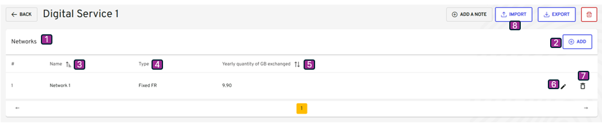

-   [Table of contents](#table-of-contents)
-   [Description](#description)
-   [Networks visualization](#networks-visualization)
-   [Networks add](#networks-add)
-   [Networks edit](#networks-edit)

## Description

This use case allows a project team to add Networks equipments, into a digital service version previously created.

**Navigation Path**

-   My Digital Services / My Digital Service view / Visualize my resources tab / Networks

**Access Conditions**
The connected user must have the write access for that module on the selected organization.

## Networks visualization

{}

| Reference | Group      | Elements                        | Type   | Description                                                                                                                                                                                |
|-----------| ---------- |---------------------------------|--------| ------------------------------------------------------------------------------------------------------------------------------------------------------------------------------------------ |
|           | Tab Header |  Visualize my resources         | Tab    |                                                                                                                                                                                            |
| 1         | Networks           |                         | Table  |                                                                                                                                                                                            |
| 2         |            | + Add                | button | <li><u>_initialization rules_</u>: That button is displayed if the connected user have the write right.  <li><u>_action rules_</u>: That button open the window Network details.  |
|           | Tab        |                                 |        |                                                                                                                                                                                             |
| 3         |            | Name                            | column |                                                                                                                                                                                           |
| 4         |            | Type                            | column |                                                                                                                                                                                            |
| 5         |            | Yearly quantity of GB exchanged | column |                                                                                                                                                                                            |
| 6         |            | Edit                            | button | <li><u>_action rules_</u>: That button open the window Network details.                                                                                                                 |
| 7         |            | Delete                          | button | <li><u>_action rules_</u>: Delete the network from the current Digital Service.  Note : The user must click on Calculate to update the footprint estimation.                            |
| 8         |            | Import              | button | <li><u>_action rules_</u>: Upload files to createnetworks  Note : The user must click on Calculate to update the footprint estimation.                                             |

{}

## Networks add
[2.3.2.1 Add or Visualize Networks via form](add_visualize_networks_via_forms.md)

[2.3.2.2 Add Networks by importing files](import_network_via_button)

## Networks edit

Navigation Path
My Digital Services / My Digital Service / Visualize my resources tab /Networks / Modify Networks

{}

| Reference | Elements                  | Type         | Description                                                             |
| --------- |---------------------------|--------------| ----------------------------------------------------------------------- |
| 1         | New Server or Edit Server | title        |                                                                         |
| 2         | Name                      | label input  |                                                                         |
| 3         | Type                      | label input  |                                                                         |
| 4         | Total quanitity           | label input |                                                                         |
| 5         | Cancel                    | button       | <li><u>_action rules_</u>: That button open the window Network details. |
| 6         | Next                      | button       |                                                                         |

{}

