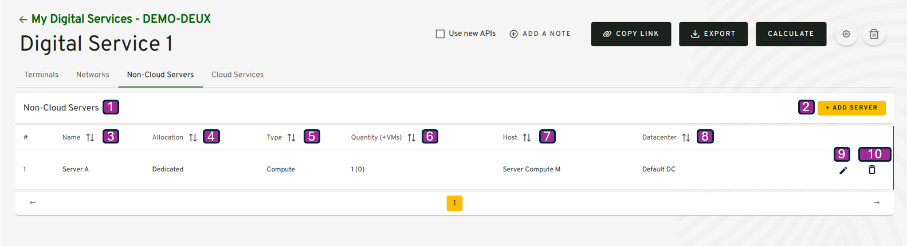
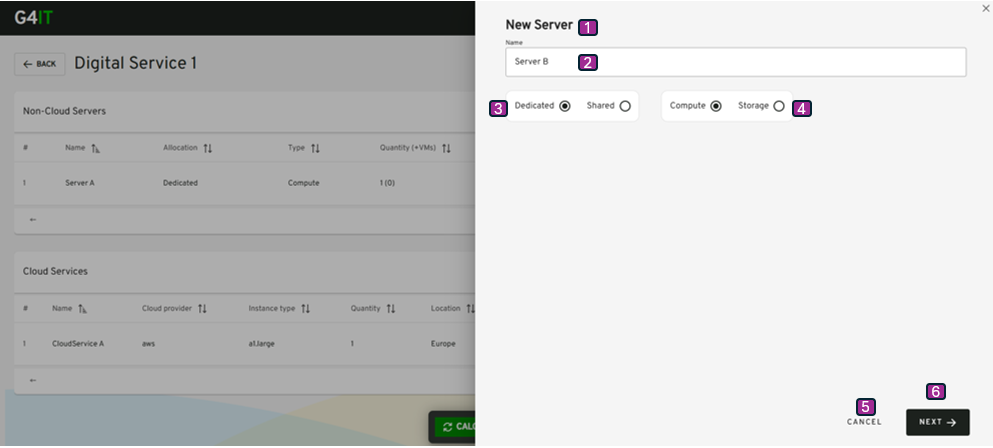

-   [Table of contents](#table-of-contents)
-   [Description](#description)
-   [Private Infrastructure visualization](#private-infrastructure-visualization)
-   [Private Infrastructure add](#private-infrastructure-add)
-   [Private Infrastructure edit](#private-infrastructure-edit)

## Description

This use case allows a project team to add Private Infrastructure equipment directly via form, into a digital service version previously created.

**Navigation Path**

-   My Digital Services / Digital Service Version view / Visualize my resources tab / Private Infrastructures

**Access Conditions**
The connected user must have the write access for that module on the selected organization.

## Private Infrastructure visualization

{}

| Reference | Group                   | Elements          | Type   | Description                                                                                                                                                                           |
|-----------|-------------------------| ----------------- |--------|---------------------------------------------------------------------------------------------------------------------------------------------------------------------------------------|
|           | Tab Header              | Visualize my resources | tab    |                                                                                                                                                                                       |
| 1         | Private Infrastructures |  | table  |                                                                                                                                                                                       |
| 2         |                         | + Add    | button | <li><u>_initialization rules_</u>: That button is displayed if the connected user have the write right. <li><u>_action rules_</u>: That button open the window Add Server details. |
|           | Tab                     |                   |        |                                                                                                                                                                                       |
| 3         |                         | Name              | column |                                                                                                                                                                                       |
| 4         |                         | Allocation        | column |                                                                                                                                                                                       |
| 5         |                         | Type              | column |                                                                                                                                                                                       |
| 6         |                         | Quantity (+VMs)   | column |                                                                                                                                                                                       |
| 7         |                         | Host              | column |                                                                                                                                                                                       |
| 8         |                         | Datacenter        | column |                                                                                                                                                                                       |
| 9         |                         | Edit              | button | <li><u>_action rules_</u>: That button open the window non-cloud servers details.                                                                                                     |
| 10        |                         | Delete            | button | <li><u>_action rules_</u>: Delete the non cloud servers from the current Digital Service. Note : The user must click on Calculate to update the footprint estimation.              |
| 11        |                         | Import              | button | <li><u>_action rules_</u>: Upload files to create public cloud - IaaS or private infrastructures  Note : The user must click on Calculate to update the footprint estimation.      |

{}

## Private Infrastructure add
[2.3.3.1 Add or Visualize Private Infrastructure via form](add_visualize_nonCloud_servers_via_forms.md)

[2.3.3.2 Add Private Infrastructure by importing files](import_nonCloud_servers_via_button.md)

## Private Infrastructure edit

Navigation Path
My Digital Services / My Digital Service / Visualize my resources tab /Private Infrastructures / Modify Private Infrastructure

{}

| Reference | Elements                  | Type         | Description                                                             |
| --------- | ------------------------- | ------------ | ----------------------------------------------------------------------- |
| 1         | New Server or Edit Server | title        |                                                                         |
| 2         | Name                      | label input  |                                                                         |
| 3         | Dedicated or Shared       | Radio button |                                                                         |
| 4         | Compute or Storage        | Radio button |                                                                         |
| 5         | Cancel                    | button       | <li><u>_action rules_</u>: That button open the window Network details. |
| 6         | Next                      | button       |                                                                         |

{}

