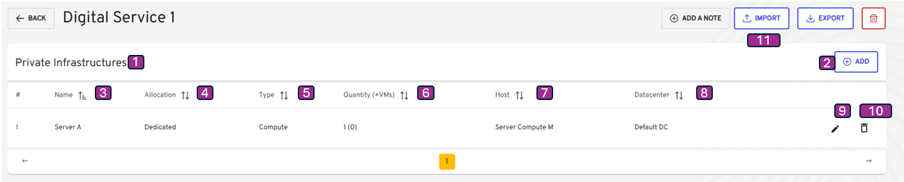
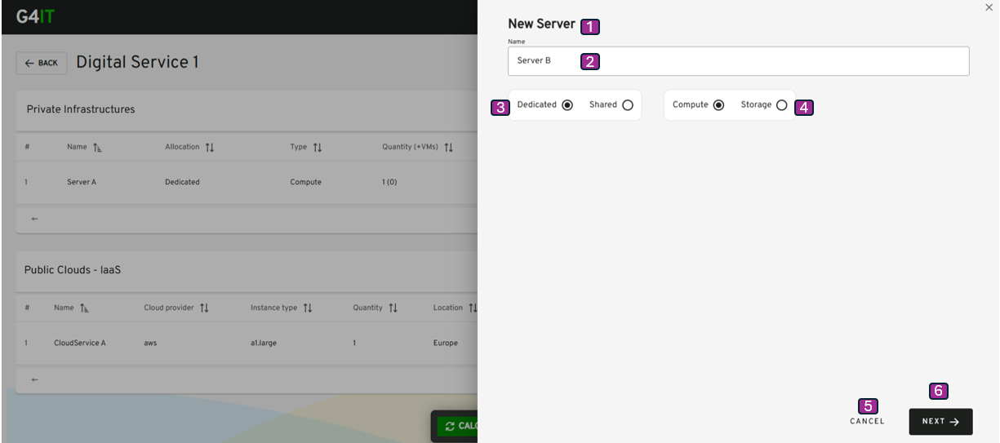

-   [Table of contents](#table-of-contents)
-   [Description](#description)
-   [Non-Cloud Server visualization](#non-cloud-server-visualization)
-   [Non-Cloud Server add](#non-cloud-server-add)
-   [Non-Cloud Server edit](#non-cloud-server-edit)

## Description

This use case allows a project team to add Non-Cloud Servers equipment directly via form, into a digital service previously created.

**Navigation Path**

-   My Digital Services / My Digital Service view / Non-Cloud Servers

**Access Conditions**
The connected user must have the write access for that module on the selected organization.

## Non-Cloud Server visualization

{}

| Reference | Group      | Elements          | Type   | Description                                                                                                                                                                           |
| --------- | ---------- | ----------------- | ------ |---------------------------------------------------------------------------------------------------------------------------------------------------------------------------------------|
|           | Tab Header |                   | group  |                                                                                                                                                                                       |
| 1         |            | Non-Cloud Servers | title  |                                                                                                                                                                                       |
| 2         |            | + Add Server      | button | <li><u>_initialization rules_</u>: That button is displayed if the connected user have the write right. <li><u>_action rules_</u>: That button open the window Add Server details. |
|           | Tab        |                   |        |                                                                                                                                                                                       |
| 3         |            | Name              | column |                                                                                                                                                                                       |
| 4         |            | Allocation        | column |                                                                                                                                                                                       |
| 5         |            | Type              | column |                                                                                                                                                                                       |
| 6         |            | Quantity (+VMs)   | column |                                                                                                                                                                                       |
| 7         |            | Host              | column |                                                                                                                                                                                       |
| 8         |            | Datacenter        | column |                                                                                                                                                                                       |
| 9         |            | Edit              | button | <li><u>_action rules_</u>: That button open the window non-cloud servers details.                                                                                                     |
| 10        |            | Delete            | button | <li><u>_action rules_</u>: Delete the non cloud servers from the current Digital Service. Note : The user must click on Calculate to update the footprint estimation.              |

{}

## Non-Cloud Server add
[2.3.3.1 Add or Visualize Non-Cloud Server via form](add_visualize_nonCloud_servers_via_forms.md)

[2.3.3.2 Add Non-Cloud Servers by importing files](import_nonCloud_servers_via_button.md)

## Non-Cloud Server edit

Navigation Path
My Digital Services / My Digital Service / Non-Cloud Server / Modify Non-Cloud Server

{}

| Reference | Elements                  | Type         | Description                                                             |
| --------- | ------------------------- | ------------ | ----------------------------------------------------------------------- |
| 1         | New Server or Edit Server | title        |                                                                         |
| 2         | Name                      | label input  |                                                                         |
| 3         | Dedicated or Shared       | Radio button |                                                                         |
| 4         | Compute or Storage        | Radio button |                                                                         |
| 5         | Cancel                    | button       | <li><u>_action rules_</u>: That button open the window Network details. |
| 6         | Next                      | button       |                                                                         |

{}

