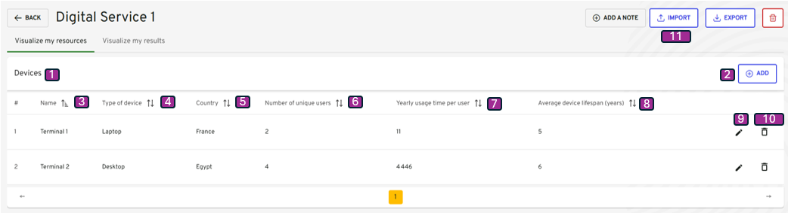

-   [Table of contents](#table-of-contents)
-   [Description](#description)
-   [Devices visualization](#devices-visualization)
-   [Devices add](#devices-add)
-   [Devices edit](#devices-edit)

## Description

This use case allows a project team to add Devices equipment, into a digital service previously created.

**Navigation Path**

-   My Digital Services / My Digital Service view / Visualize my resources tab / Devices

**Access Conditions**
The connected user must have the write access for that module on the selected organization.

## Devices visualization

{}

| Reference | Group      | Elements          | Type   | Description                                                                                                                                                                           |
|-----------|------------| ----------------- |--------|---------------------------------------------------------------------------------------------------------------------------------------------------------------------------------------|
|           | Tab Header | Visualize my resources | tab    |                                                                                                                                                                                       |
| 1         | Devices    |  | table  |                                                                                                                                                                                       |
| 2         |            | + Add    | button | <li><u>_initialization rules_</u>: That button is displayed if the connected user have the write right. <li><u>_action rules_</u>: That button open the window Add Server details. |
|           | Tab        |                   |        |                                                                                                                                                                                       |
| 3         |            | Name              | column |                                                                                                                                                                                       |
| 4         |            | Allocation        | column |                                                                                                                                                                                       |
| 5         |            | Type              | column |                                                                                                                                                                                       |
| 6         |            | Quantity (+VMs)   | column |                                                                                                                                                                                       |
| 7         |            | Host              | column |                                                                                                                                                                                       |
| 8         |            | Datacenter        | column |                                                                                                                                                                                       |
| 9         |            | Edit              | button | <li><u>_action rules_</u>: That button open the window devices details.                                                                                                               |
| 10        |            | Delete            | button | <li><u>_action rules_</u>: Delete the devices from the current Digital Service. Note : The user must click on Calculate to update the footprint estimation.                        |
| 11        |            | Import              | button | <li><u>_action rules_</u>: Upload files to create devices  Note : The user must click on Calculate to update the footprint estimation.                                             |

{}

## Devices add
[2.3.3.1 Add or Visualize Devices via form](add_visualize_terminals_via_forms.md)

[2.3.3.2 Add Devices by importing files](import_terminal_via_button)

## Devices edit

Navigation Path
My Digital Services / My Digital Service / Visualize my resources tab /Devices / Modify Devices

{}

| Reference | Elements                    | Type        | Description                                                             |
|-----------|-----------------------------|-------------|-------------------------------------------------------------------------|
| 1         | New Device                  | title       |                                                                         |
| 2         | Name                        | label input |                                                                         |
| 3         | Type of Device              | label input |                                                                         |
| 4         | Country                     | label input |                                                                         |
| 5         | Number of unique user       | label input |                                                                         |
| 6         | Average timr spent per user | label input |                                                                         |
| 7         | Average device lifespan     | label input | <li><u>_action rules_</u>: That button open the window Network details. |
| 8         | Cancel                      | button      |                                                                         |
| 9         | Add                         | button      |                                                                         |

{}

