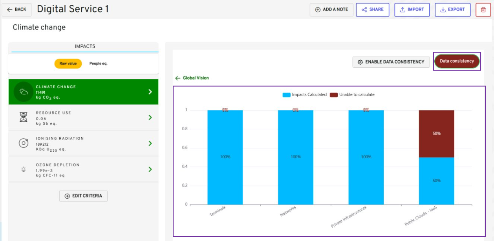

## Table of contents

-   [Table of contents](#table-of-contents)
-   [Description](#description)
-   [State Diagram](#state-diagram)
-   [Mockup](#mockup)
-   [Global view](#global-view)
-   [View by criteria](#view-by-criteria)
-   [Data consistency view](#data-consistency-view)
-   [Sequence Diagram](#sequence-diagram)

## Description

The use case allows a project team to visualize the impacts of terminals, networks and servers of a digital service version.
The key indicators displayed on the radar graph are terminal, network and server equipment.

**Navigation Path**

-   My Digital Services / Digital Service Version view / Visualize my results tab

- **Access Conditions**
  The connected user must have the read access for that module on the selected workspace.

## State Diagram


graph TD;
Step1[Digital Service Version view] --> Decision1{First Calculation is done?}
Decision1-->|Yes|Step2[Tab 'Visualize my results' is enabled]
Decision1-->|No|Step3[Tab 'Visualize my results' is not enabled]
Step2-->|Click on 'Visualize my results' button|Step4[Multi criteria view about the impacts of my Digital Service Version is displayed]-->|Click on one of the criteria impacts in the bar menu, or on the graph|Step5[Specific view for this criteria is displayed]-->|New filters selected|Step8
Step8[View is updated according to the filters]
Step8-->|Click on 'Global Vision' button|Step4


## Mockup

[2.5.1. Visualize digital service version's terminal footprint](visualize_terminal_footprint.md)

[2.5.2. Visualize digital service version's network footprint](visualize_network_footprint.md)

[2.5.3. Visualize digital service version's Private Infrastructure footprint](visualize_non-cloud-server_footprint.md)

[2.5.4. Visualize digital service version's Public Cloud - IaaS footprint](visualize_cloud-service_footprint.md)

### Global view

{}

| Reference | Group                      | Elements                            | Sub-Elements            | Type   | Description                                                                                                                                                                                                                                             |
|-----------|----------------------------|-------------------------------------|-------------------------|--------|---------------------------------------------------------------------------------------------------------------------------------------------------------------------------------------------------------------------------------------------------------|
|           | Page Header                |                                     |                         | group  |                                                                                                                                                                                                                                                         |
| 1         |                            | The digital service name            |                         | label  | <li><u>_initialization rules_</u>: Name of the selected digital service for which the user want to visualize footprints. The type of visualization (Equipment) is also shown.                                                                           |
| 2         |                            | Add a note                          |                         | button | <li><u>_action rules_</u>: Details of the behaviour is described in _to complete_.                                                                                                                                                                      |
| 3         |                            | Import                              |                         | button | <li><u>_action rules_</u>: Click to Upload files to create cloud services or non-cloud services </li>                                                                                                                                                   |
| 4         |                            | Export                              |                         | button | <li><u>_action rules_</u>: Data can be exported at any time after the first calculation. Details of the behaviour is described in [2.6 Export files](./uc6_export_digital_service.md).                                                                  |
| 5         |                            | Edit Criteria                       |                         | button | <li><u>_action rules_</u>: Update the criteria for digital service to re-calculate estimates upon. Details of the behaviour is described in [3.2.5 Choose criteria](../../uc_administration/uc_administration_manage_workspaces/uc5_choose_criteria.md) |
| 6         |                            | Duplicate digital service version   |                         | button | <li><u>_action rules_</u>: Duplicate the digital service version. Details of the behaviour is described in [2.9.2 Export files](./duplicate_digital_service_version.md).                                                                                |
|           | Overall view of the impact |                                     |                         | group  |                                                                                                                                                                                                                                                         |
| 7         |                            | Raw value or People equivalent view |                         | tab    | <li><u>_action rules_</u>: Each tab represents the impact for one specific criterion with the people eq.                                                                                                                                                |
| 8         |                            | Criteria selection                  |                         | tab    | <li><u>_action rules_</u>: Each tab represents the impact for one specific criterion with the raw values.                                                                                                                                               |
| 9         |                            | Graphical visualization             |                         | group  | Radar graph representing the equipment’s impact by criteria in people eq.s **criteria**.                                                                                                                                                                |
| 10        |                            |                                     | Equipment type          | button | <li><u>_action rules_</u>: Click to view graph of the impact for each equipment type i.e terminal, network, non- cloud server or cloud services.</li>                                                                                                   |
| 11        |                            |                                     | Graph                   | radar  | <li><u>_action rules_</u>: By overflowing, the user can collect data corresponding to certain terminals, networks and servers. A click on a specific criteria redirects to view by criteria. </li>                                                      |
| 12        |                            | Data Consistency                    | Enable Data Consistency | button | <li><u>_action rules_</u>: Click to enable the data consistency view. See [Global concepts/ Data consistency](../../../global_concepts/uc1_dataconsistency.md) </li>                                                                                    |
| 13        |                            |                                     | Data Consistency        | button | <li><u>_action rules_</u>: Click to view graph of data consistency for all criteria. See [Global concepts/ Data consistency](../../../global_concepts/uc1_dataconsistency.md)                                                    </li>                        |
| 14        | Information card           |                                     |                         | group  | Quick description of what the graph represents.                                                                                                                                                                                                         |
| 15        |                            | Manage Versions                                    |                         | button  | <li><u>_action rules_</u>: Manage the digital service versions. Details of the behaviour is described in [2.9.1 Manage Digital Service Versions](./manage_digital-service_version.md).                                                                  |
| 16        |                            | The digital service version name    |                         | label  | <li><u>_initialization rules_</u>: Name of the digital service version for which the user want to visualize footprints.                                                                                                                                 |

{}

### View by criteria

### Data consistency view

{}

| Reference | Group | Elements      | Sub-Elements | Type         | Description                                                                                                                                                          |
| --------- | ----- | ------------- | ------------ | ------------ |----------------------------------------------------------------------------------------------------------------------------------------------------------------------|
| 1         |       | Graph by type |              | radio button | <li><u>_action rules_</u>: Click the radio button to see the filtered view. See [Global concepts/ Data consistency](../../../global_concepts/uc1_dataconsistency.md) |

{}

## Sequence Diagram


sequenceDiagram
actor RND as project team
participant front as G4IT Front-End
participant back as G4IT Back-End
participant DataBase

RND ->> front: Click on "Visualize my results" button in the digital service version view
front ->> back: GET /api/organizations/{organization}/workspaces/{workspace}/digital-service-version/{digitalServiceVersionUid}/outputs/physical-equipments
DataBase-->> back: Get indicators from out_physical_equipment table
back-->> front: Send the physical equipment indicators for the multi-criteria view
front ->> back: GET /api/organizations/{organization}/workspaces/{workspace}/digital-service-version/{digitalServiceVersionUid}/outputs/virtual-equipments
DataBase-->> back: Get indicators from out_virtual_equipment table
back-->> front: Send the virtual equipment indicators for the multi-criteria view
front->> RND : Display the indicators by equipment type to display on my view related to my view



