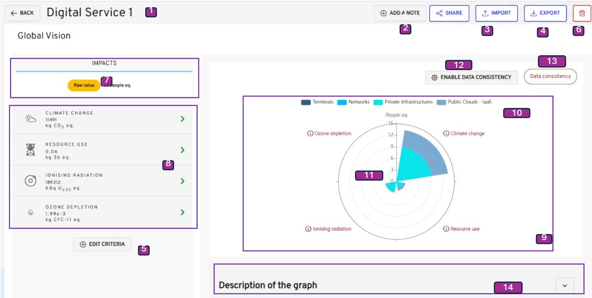
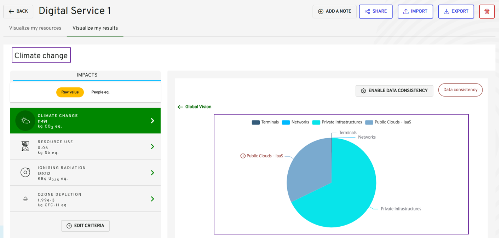

## Table of contents

-   [Table of contents](#table-of-contents)
-   [Description](#description)

## Description

The use case allows a project team to visualize the impacts of terminals, networks and servers of a digital service.
The key indicators displayed on the radar graph are terminal, network and server equipment.
The results can be filtered by the type of equipment.
It is also possible to display results for a single criteria only.

## Mockup

### Global view

{}

| Reference | Group                      | Elements                                      | Sub-Elements     | Type   | Description                                                                                                                                                                                        |
| --------- | -------------------------- | --------------------------------------------- | ---------------- | ------ | -------------------------------------------------------------------------------------------------------------------------------------------------------------------------------------------------- |
|           | Page Header                |                                               |                  | group  |                                                                                                                                                                                                    |
| 1         |                            | My Digital Services - (selected organization) |                  | title  | <li><u>_initialization rules_</u>: The title is concatenated with the current organization selected.                                                                                               |
| 2         |                            | The digital service name                      |                  | label  | <li><u>_initialization rules_</u>: Name of the selected digital service for which the user want to visualize footprints. The type of visualization (Equipment) is also shown.                      |
| 3         |                            | Add a note                                    |                  | button | <li><u>_action rules_</u>: Details of the behaviour is described in _to complete_.                                                                                                                 |
| 4         |                            | Export                                        |                  | button | <li><u>_action rules_</u>: Data can be exported at any time after the first calculation. Details of the behaviour is described in [2.6 Export files](./uc6_export_digital_service.md).             |
| 5         |                            | Calculate                                     |                  | button | <li><u>_action rules_</u>: Update the digital service to enable the button.                                                                                                                        |
| 6         |                            | Criteria selection                            |                  | button | <li><u>_action rules_</u>: Update the criteria for digital service to calculate estimates upon.                                                                                                    |
| 7         |                            | Delete digital service                        |                  | button | <li><u>_action rules_</u>: Delete the digital service                                                                                                                                              |
|           | Overall view of the impact |                                               |                  | group  |                                                                                                                                                                                                    |
| 8         |                            | Raw value or People equivalent view           |                  | tab    | <li><u>_action rules_</u>: Each tab represents the impact for one specific criterion with the people eq.                                                                                           |
| 9         |                            | Criteria selection                            |                  | tab    | <li><u>_action rules_</u>: Each tab represents the impact for one specific criterion with the raw values.                                                                                          |
| 10        |                            | Graphical visualization                       |                  | group  | Radar graph representing the equipment’s impact by criteria in people eq.s **criteria**.                                                                                                           |
| 11        |                            |                                               | Equipment type   | button | <li><u>_action rules_</u>: Click to view graph of the impact for each equipment type i.e terminal, network, non- cloud server or cloud services.</li>                                              |
| 12        |                            |                                               | Graph            | radar  | <li><u>_action rules_</u>: By overflowing, the user can collect data corresponding to certain terminals, networks and servers. A click on a specific criteria redirects to view by criteria. </li> |
| 13        |                            |                                               | Data Consistency | button | <li><u>_action rules_</u>: Click to view graph of data consistency for all criteria. See [Global concepts/ Data consistency](../../global_concepts/uc1_dataconsistency.md) </li>                   |
| 14        | Information card           |                                               |                  | group  | Quick description of what the graph represents.                                                                                                                                                    |

{}

### View by criteria

### View by equipment

### View by equipment and criteria

{}

| Reference | Group                          | Elements      | Sub-Elements | Type         | Description                                                                 |
| --------- | ------------------------------ | ------------- | ------------ | ------------ | --------------------------------------------------------------------------- |
| 1         | View by criteria and equipment |               |              | group        |                                                                             |
| 2         |                                | Graph by type |              | radio button | <li><u>_action rules_</u>: Click the radio button to see the filtered view. |

{}

### Data consistency view

{}

| Reference | Group | Elements      | Sub-Elements | Type         | Description                                                                                                                                                       |
| --------- | ----- | ------------- | ------------ | ------------ | ----------------------------------------------------------------------------------------------------------------------------------------------------------------- |
| 1         |       | Graph by type |              | radio button | <li><u>_action rules_</u>: Click the radio button to see the filtered view. See [Global concepts/ Data consistency](../../global_concepts/uc1_dataconsistency.md) |

{}

