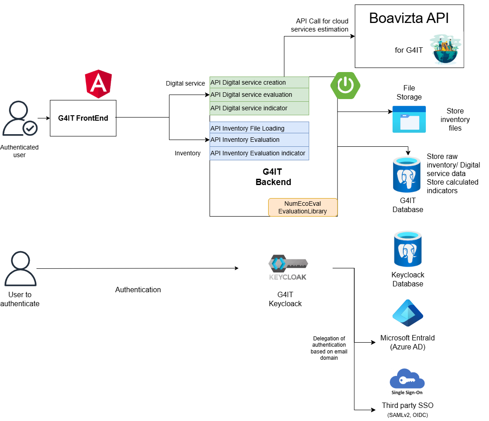

### Overview

Description of the software architecture of the project.

#### Architecture description
As seen in the functional architecture, Green for IT serves two main purposes:
* Evaluation of environmental impact of inventory of Information Systems
* Evaluation of environmental impact of digital services

It offers to the user a web UI to complete and estimate impact of their IT inventory and digital services. The user can also visualize the results of the evaluation. 
This web application is composed of a front-end and a back-end. 

The front-end is a single-page application (SPA) that is built using Angular.

The back-end is composed of RESTful API that are built using Springboot.
It stores the data in a PostgreSQL database.
The file storage is intended to store all user inventory files and to generate data exports.
The back-end uses the library numEcoEval to evaluate the environmental impact of the inventory and digital services.
It also calls dedicated G4IT Boavizta APIs to evaluate the environmental impact of cloud services.

In order to use the application, the user must be authenticated. The authentication is done using Keycloak.
Keycloak is an open-source Identity and Access Management solution aimed at modern applications and services.
It makes it easy to secure applications and services with little to no code.
Keycloak delegates the authentication to the user's identity provider as EntraId(Azure AD) or Companies third party identity provider SSO.

### Table of contents

{}
