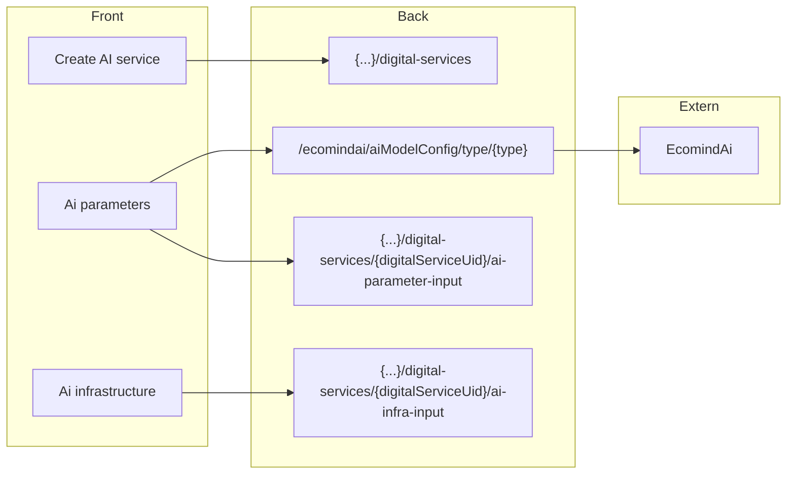
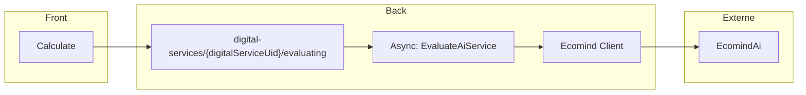
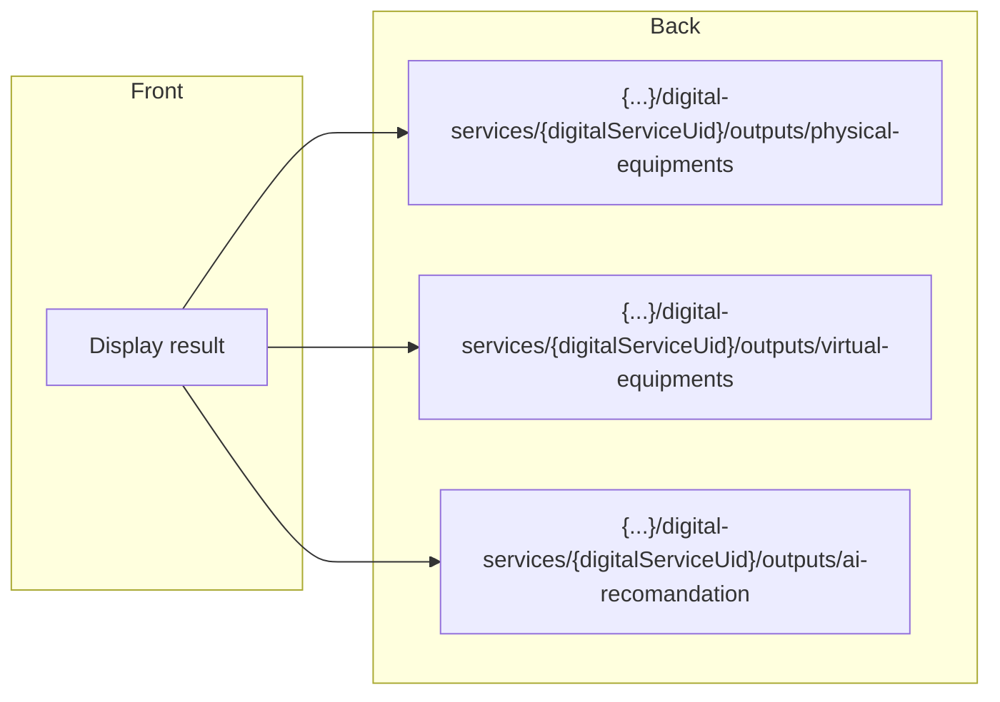

### Overview
This section illustrates the communication architecture between the frontend and backend components with the use of Ecomind.

### Display

{...} : Another part of the url used (/organizations/{organization}/workspaces/{workspace}).

Ecomind is an externally deployed service that is invoked through a client [Ai Modelapi Client](https://github.com/teamg4it/g4it/blob/develop_ecomind/services/backend/src/main/java/com/soprasteria/g4it/backend/external/ecomindai/client/AiModelapiClient.java).

### Calculation

The calculation involves multiple steps, which you can find on [Evaluating digital Service](../backend/api/evaluating/_index.md)

### Result

{...} : Another part of the url used (/organizations/{organization}/workspaces/{workspace}).

This change updates the "Visualize" tab in the digital service to present the recommendations provided by Ecomind.
