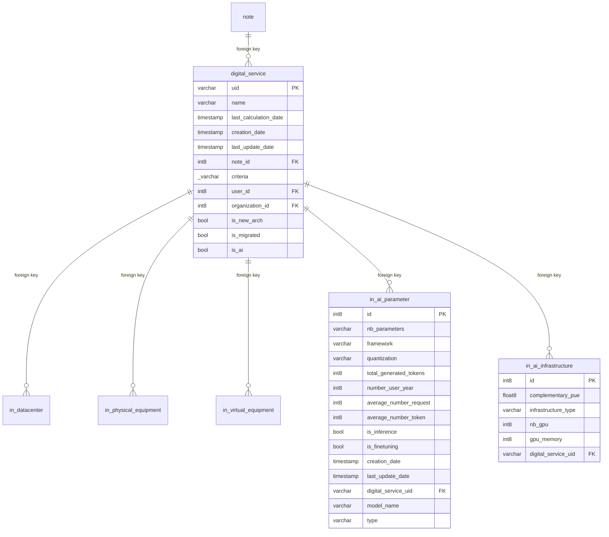

## Entity relationship diagram 

## Tables

### in_ai_parameter

{}

#### Comments

- That table present the virtual equipment data provided by a user for each  Information System or Digital Service. in order to evaluate its environmental footprint.

#### Columns

|Name|Data type| Comments                                                           |
|---|---|--------------------------------------------------------------------|
|**id**|int8| <ul><li>Auto incremented unique ai parameters identifier</li></ul> |
|nb_parameters|varchar| <ul><li>Nb_parameters of ai parameters</li></ul>                   |
|framework|varchar| <ul><li>Framework of ai parameters</li></ul>                       |
|quantization|varchar| <ul><li>Quantization of ai parameters</li></ul>                    |
|total_generated_tokens|int8| <ul><li>The total generated tokens</li></ul>                       |
|number_user_year|int8| <ul><li>Number of user per year</li></ul>                          |
|average_number_request|int8| <ul><li>Average number of request</li></ul>                        |
|average_number_token|int8| <ul><li>Average number of token</li></ul>                          |
|is_inference|bool| <ul><li>The inference type</li></ul>                               |
|is_finetuning|bool| <ul><li>The finetuning type</li></ul>                              |
|creation_date|timestamp| <ul><li>Ai parameters Creation Date</li></ul>                      |
|last_update_date|timestamp| <ul><li>Ai parameters Last update date</li></ul>                   |
|*digital_service_uid*|varchar| <ul><li>Foreign key to the Digital service</li></ul>               |
|model_name|varchar| <ul><li>The model name</li></ul>                                   |
|type|varchar| <ul><li>the type</li></ul>                                         |

#### Primary Key

- id
#### Foreign keys
|Column name|Referenced table|Referenced primary key|
|---|---|---|
|digital_service_uid|digital_service|uid|

{}
### in_ai_infrastructure

{}

#### Comments

- That table present the virtual equipment data provided by a user for each  Information System or Digital Service. in order to evaluate its environmental footprint.

#### Columns

|Name|Data type| Comments                                                               |
|---|---|------------------------------------------------------------------------|
|**id**|int8| <ul><li>Auto incremented unique ai infrastructure identifier</li></ul> |
|complementary_pue|float8| <ul><li>Complementary pue</li></ul>                                    |
|infrastructure_type|varchar| <ul><li>Infrastructure type</li></ul>                                  |
|nb_gpu|int8| <ul><li>Number of gpu</li></ul>                                        |
|gpu_memory|int8| <ul><li>Memory of the gpu</li></ul>                                    |
|*digital_service_uid*|varchar| <ul><li>Foreign key to the Digital service</li></ul>                   |

#### Primary Key

- id
#### Foreign keys
|Column name|Referenced table|Referenced primary key|
|---|---|---|
|digital_service_uid|digital_service|uid|

{}

