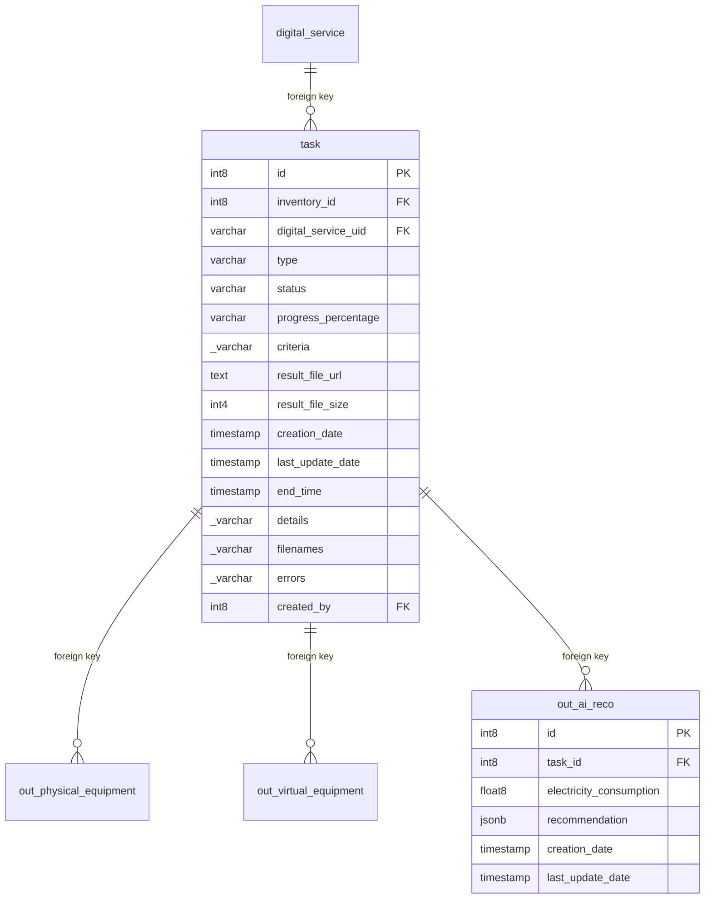

## Entity relationship diagram

## Tables

### out_ai_reco

{}

#### Comments

- This table contains the results of the Ecomind indicator call for the digital service.

#### Columns

| Name                      |Data type| Comments                                                               |
|---------------------------|---|------------------------------------------------------------------------|
| **id**                    |int8| <ul><li>Auto incremented unique virtual equipment identifier</li></ul> |
| *task_id*                 |int8| <ul><li>Foreign key to the task</li></ul>                              |
| *electricity_consumption* |float8| <ul><li>The electricity consumption return by ecomind</li></ul>        |
| *recommendation*          |jsonb| <ul><li>The recommendations return by ecomind</li></ul>                |
| *creation_date*           |timestamp| <ul><li>The creation date</li></ul>                                    |
| *last_update_date*        |timestamp| <ul><li>The last update date</li></ul>                                 |

#### Primary Key

- id
#### Foreign keys
|Column name|Referenced table|Referenced primary key|
|---|---|---|
|task_id|task|id|

{}

