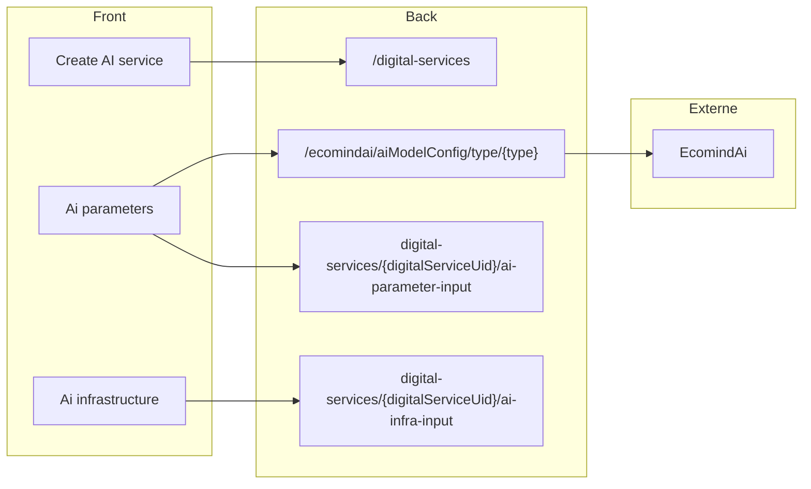
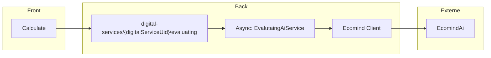
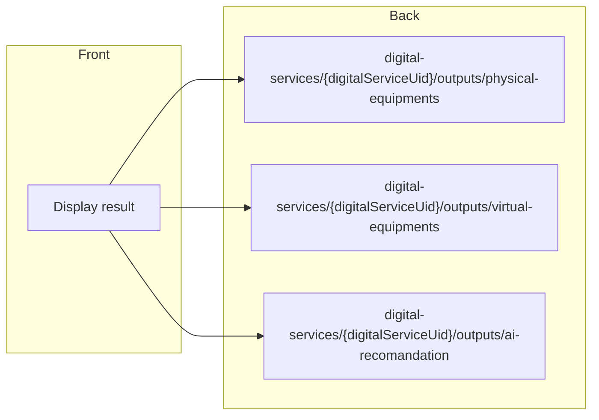

### Overview

### Display

```mermaid
flowchart LR
    subgraph Front
        A["Create AI service"]
        B["Ai parameters"]
        C["Ai infrastructure"]
    end

    subgraph Back
        A1["/digital-services"]
        B1["/ecomindai/aiModelConfig/type/{type}"]
        B2["digital-services/{digitalServiceUid}/ai-parameter-input"]
        C1["digital-services/{digitalServiceUid}/ai-infra-input"]
    end

    subgraph Externe
        B11["EcomindAi"]
    end

    A --> A1
    B --> B1
    B --> B2
    C --> C1
    B1 --> B11
```

### Calculation

```mermaid
flowchart LR
    subgraph Front
        A["Calculate"]
    end

    subgraph Back
        A1["digital-services/{digitalServiceUid}/evaluating"]
        A2["Async: EvalutaingAiService"]
        A3["Ecomind Client"]
    end

    subgraph Externe
        B11["EcomindAi"]
    end

    A --> A1
    A1 --> A2
    A2 --> A3
    A3 --> B11
```

### Result

```mermaid
flowchart LR
    subgraph Front
        A["Display result"]
    end

    subgraph Back
        A1["digital-services/{digitalServiceUid}/outputs/physical-equipments"]
        A2["digital-services/{digitalServiceUid}/outputs/virtual-equipments"]
        A3["digital-services/{digitalServiceUid}/outputs/ai-recomandation"]
    end

    A --> A1
    A --> A2
    A --> A3
```
