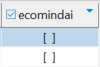

## New user roles

New roles have been created following the implementation of Ecomind on G4IT : 

- ROLE_ECO_MIND_AI_READ
- ROLE_ECO_MIND_AI_WRITE (if the user has this role he also has the READ one)

If the user only has the READ access he is only able to check the digital service and export it without being able to modify infrastructure and parameters fields.
With the WRITE access he can also edit infrastructure and parameters fields and launch a calculation.

## New subscriber role access

By default, not all subscribers have access to Ecomind. A new column has been added to the **g4it_subscriber** table to enable/disable Ecomind for a subscriber.

This column is called **ecomindai** and is false by default. This column can only be edited via the database.

You can check [how to enable Ecomind module for a particular subscriber on G4IT](../../../../../1-getting-started/3-getting-started-as-a-maintainer/1-how-to/enable_ecomind_for_a_subscriber/_index.md) page to find out how to change its value.
