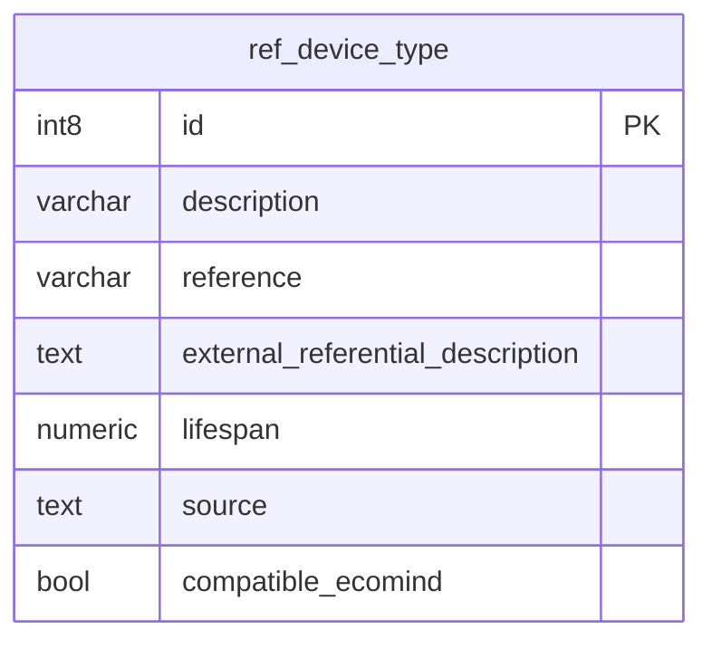

## Entity relationship diagram

## Tables

### ref_device_type

{}

#### Comments

- This table lists the device type which can be selected for the Digital Service definition

#### Columns

|Name|Data type|Comments|
|---|---|---|
|**id**|int8||
|description|varchar||
|reference|varchar||
|external_referential_description|text||
|lifespan|numeric||
|source|text||
|compatible_ecomind|bool||

#### Primary Key

- id
  {}

