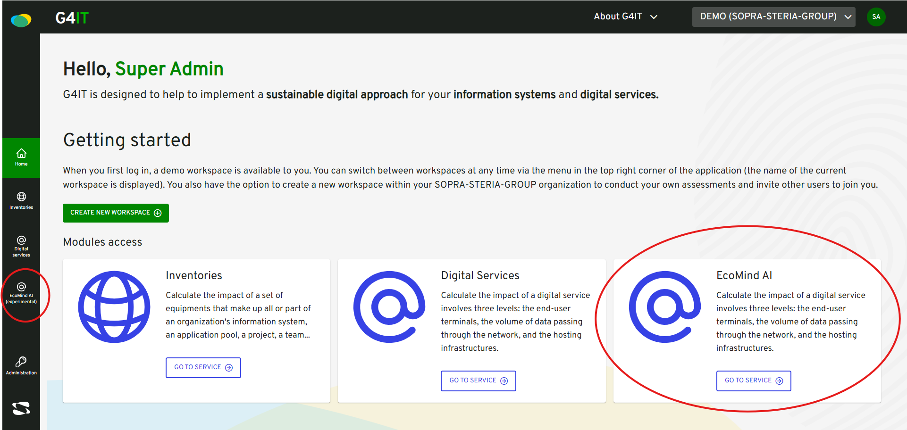

## The existing roles of Ecomind on G4IT

There are 3 different conditions for a user to have access to Ecomind on G4IT : 

### Global Ecomind module activation

You can check [how to enable Ecomind module](../../../1-getting-started/3-getting-started-as-a-maintainer/1-how-to/enable_ecomind_module/_index.md) page to know how to globally enable Ecomind. 

- If this variable is set to false then no one will be able to access Ecomind, including a super admin.

### Ecomind module activation for a particular subscriber

You can check [how to enable Ecomind module for a subscriber](../../../1-getting-started/3-getting-started-as-a-maintainer/1-how-to/enable_ecomind_for_a_subscriber/_index.md) page to know how to enable Ecomind for a particular subscriber.

- If the global Ecomind module is set to true and Ecomind is set to false for a subscriber then no one will be able to access Ecomind on this subscriber, including a super admin.

- If the global Ecomind module is set to true and Ecomind is set to true for a subscriber, the access will depend on the user's roles. A super admin has access to Ecomind.

### Ecomind module roles for a particular user

You can check [new user's Ecomind roles](../backend/db/ecomind_roles_management/_index.md) to have a look at new Ecomind roles.

- If the global Ecomind module is set to true and Ecomind is set to true for a subscriber, if a user has not the role "ROLE_ECO_MIND_AI_READ" or "ROLE_ECO_MIND_AI_WRITE" then he has no access to Ecomind

- If the global Ecomind module is set to true and Ecomind is set to true for a subscriber, if a user has the role "ROLE_ECO_MIND_AI_READ" or "ROLE_ECO_MIND_AI_WRITE" then he has access to Ecomind

When these 3 conditions are true, you should see this :   

