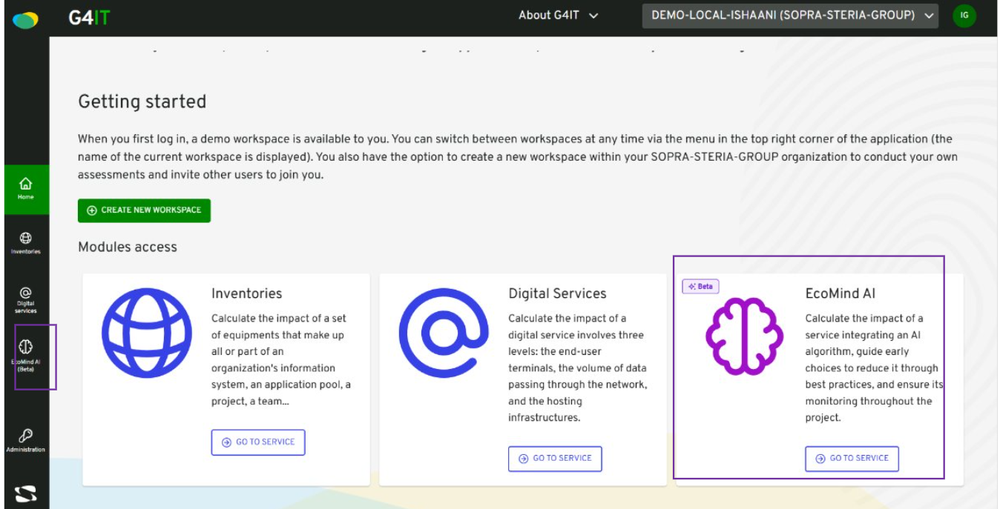

There are 3 different conditions for a user to have access to Ecomind on G4IT : 

### Global Ecomind module activation

You can check [how to enable Ecomind module](../../1-getting-started/3-getting-started-as-a-maintainer/1-how-to/ecomind/1-enable_ecomind_module/_index.md) page to know how to globally enable Ecomind. 

- If this variable is set to false then no one will be able to access Ecomind, including a super admin.

### Ecomind module activation for a particular organization

You can check [how to enable Ecomind module for an organization](../../1-getting-started/3-getting-started-as-a-maintainer/1-how-to/ecomind/2-enable_ecomind_for_a_organization/_index.md) page to know how to enable Ecomind for a particular organization.

- If the global Ecomind module is set to true and Ecomind is set to false for an organization then no one will be able to access Ecomind on this organization, including a super admin.

- If the global Ecomind module is set to true and Ecomind is set to true for an organization, the access will depend on the user's roles. A super admin has access to Ecomind.

### Ecomind module roles for a particular user

- If the global Ecomind module is set to true, if Ecomind is set to true for an organization and if a user has not the role "ROLE_ECO_MIND_AI_READ" or "ROLE_ECO_MIND_AI_WRITE" then he has no access to Ecomind

- If the global Ecomind module is set to true, if Ecomind is set to true for an organization and if a user has the role "ROLE_ECO_MIND_AI_READ" or "ROLE_ECO_MIND_AI_WRITE" then he has access to Ecomind

When these 3 conditions are true, you should see this :   

