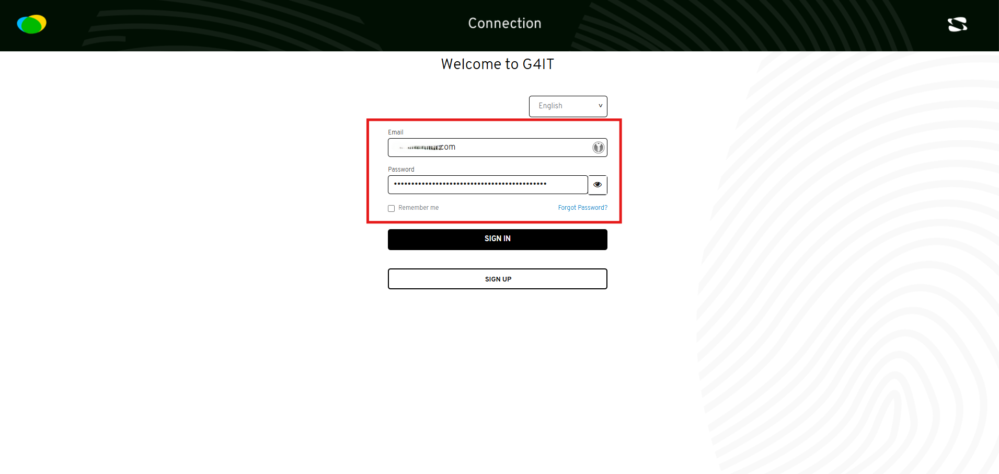
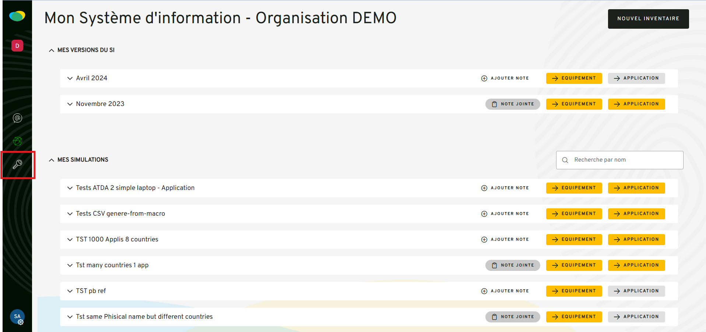

## Prerequisites

1. [ ] Migration must be performed starting from version **2.11.0** and before **3.0.0**.
2. [ ] You must have **super admin credentials**.

---

## Starting the Data Migration to the New Architecture

### Step 1: Log in to G4IT as a Super Admin



### Step 2: Access the Administration Module



### Step 3: Launch the Migration from the Super Admin Tab


Once initiated, the migration process includes the following steps:

- **Creation of inventories and digital services** in the new architecture tables. In the `digital_service`
  and `inventory` tables, the following fields will be set to `TRUE`:
    - `is_new_arch`
    - `is_migrated`

- **Copying data** from the old architecture tables to the new ones:
    - `in_datacenter`
    - `in_physical_equipment`
    - `in_virtual_equipment`
    - `in_application`

- **Evaluation** is triggered for all migrated digital services and inventories.  
  You can monitor the progress through logs showing the status of each task.
- **Check** after the migration that these following tables contain the output data for your digital services and
  inventories :
    - `out_datacenter`
    - `out_physical_equipment`
    - `out_virtual_equipment`
    - `out_application`

---

## SQL Queries to Roll Back Data Created by the Migration

```sql
DELETE FROM in_datacenter 
WHERE digital_service_uid IN (
  SELECT uid FROM digital_service WHERE is_migrated = true
);

DELETE FROM in_physical_equipment 
WHERE digital_service_uid IN (
  SELECT uid FROM digital_service WHERE is_migrated = true
);

DELETE FROM in_virtual_equipment 
WHERE infrastructure_type = 'NON_CLOUD_SERVERS'
AND digital_service_uid IN (
  SELECT uid FROM digital_service WHERE is_migrated = true
);

DELETE FROM in_application 
WHERE digital_service_uid IN (
  SELECT uid FROM digital_service WHERE is_migrated = true
);

DELETE FROM out_physical_equipment 
WHERE task_id IN (
  SELECT id FROM task 
  WHERE digital_service_uid IN (
    SELECT uid FROM digital_service WHERE is_migrated = true
  )
);

DELETE FROM out_virtual_equipment 
WHERE infrastructure_type = 'NON_CLOUD_SERVERS'
AND task_id IN (
  SELECT id FROM task 
  WHERE digital_service_uid IN (
    SELECT uid FROM digital_service WHERE is_migrated = true
  )
);

DELETE FROM out_application 
WHERE task_id IN (
  SELECT id FROM task 
  WHERE digital_service_uid IN (
    SELECT uid FROM digital_service WHERE is_migrated = true
  )
);

DELETE FROM task 
WHERE digital_service_uid IN (
  SELECT uid FROM digital_service WHERE is_migrated = true
);

UPDATE digital_service 
SET is_new_arch = false, is_migrated = false 
WHERE is_migrated = true;

DELETE FROM in_datacenter 
WHERE inventory_id IN (
  SELECT id FROM inventory WHERE is_migrated = true
);

DELETE FROM in_physical_equipment 
WHERE inventory_id IN (
  SELECT id FROM inventory WHERE is_migrated = true
);

DELETE FROM in_virtual_equipment 
WHERE infrastructure_type = 'NON_CLOUD_SERVERS'
AND inventory_id IN (
  SELECT id FROM inventory WHERE is_migrated = true
);

DELETE FROM in_application 
WHERE inventory_id IN (
  SELECT id FROM inventory WHERE is_migrated = true
);

DELETE FROM out_physical_equipment 
WHERE task_id IN (
  SELECT id FROM task 
  WHERE inventory_id IN (
    SELECT id FROM inventory WHERE is_migrated = true
  )
);

DELETE FROM out_virtual_equipment 
WHERE infrastructure_type = 'NON_CLOUD_SERVERS'
AND task_id IN (
  SELECT id FROM task 
  WHERE inventory_id IN (
    SELECT id FROM inventory WHERE is_migrated = true
  )
);

DELETE FROM out_application 
WHERE task_id IN (
  SELECT id FROM task 
  WHERE inventory_id IN (
    SELECT id FROM inventory WHERE is_migrated = true
  )
);

DELETE FROM task 
WHERE inventory_id IN (
  SELECT id FROM inventory WHERE is_migrated = true
);

UPDATE inventory 
SET is_new_arch = false, is_migrated = false 
WHERE is_migrated = true;
