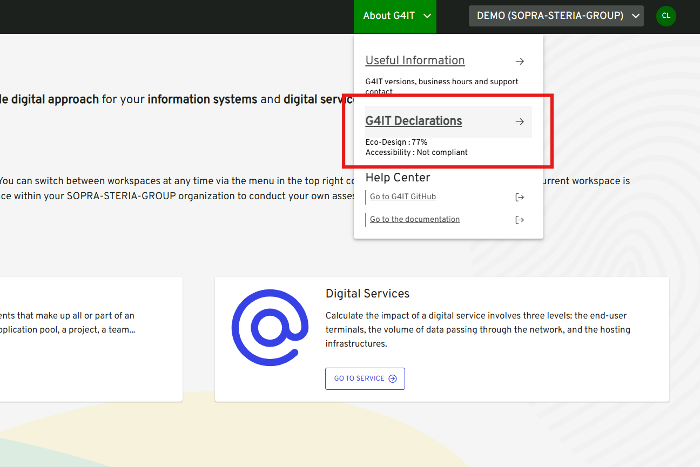
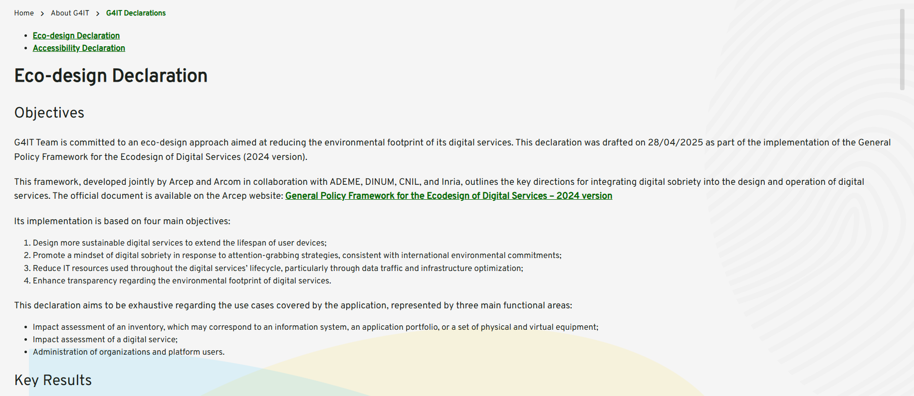

## Prerequisites

1. [ ] Migration must be performed starting from version **3.2.0**.
2. [ ] You must have **super admin credentials**.

## Overview

### New Compliance Declarations Available

We have published two important declarations:
- **Eco-design declaration**
- **Accessibility declaration**

These documents are now available and reflect our commitment to sustainable and inclusive digital services.

A description of this page is available in the functional documentation: [Functional Documentation/Declarations page](../2-functional-documentation/use_cases/uc_navigation_menu/uc4_declarations_page.md)

### Enhanced DEMO Workspace for Feature Exploration

The DEMO workspace has been redesigned to better support the presentation and discovery of G4IT’s features. This redesign introduces two major changes:

#### 1. Shared Digital Services Within Workspaces

Digital services are no longer visible only to their creators. From now on, any digital service created within a shared workspace will be accessible to all members of that workspace. This change promotes collaboration and transparency within teams.

#### 2. Migration of DEMO Services to Personal Workspaces

To ensure a clean and consistent DEMO environment, all digital services previously created by users in the DEMO workspace will be migrated to their respective personal workspaces. In these personal spaces, users will retain full control over access rights and can choose to share their services with specific users as needed.

### Decommissioning of Legacy Sharing Features

With the introduction of workspace-level sharing, the previous feature allowing individual service-level sharing has been **deprecated and decommissioned**. Sharing is now managed at the workspace level to simplify collaboration.

### DEMO Workspace: Read-Only by Default

To maintain the integrity of the DEMO environment, it will now be **read-only by default**. This ensures that all users can explore example services without modifying them.

Additionally, **data export will be enabled** in this read-only mode, allowing users to reuse the example services by importing them into their personal workspaces.

## Content

### V3.3.0

**Major Changes**

-   1079 | [BE]: Migrate digital services from "Demo" workspace to new workspace
-   1001 | Modify the first connection workflow
-   1149 | Visualize ecodesign & accessibility declaration
-   1003 | Remove the link between a user and a digital service

**Minor Changes**

-   1166 | [BE]: Allow G4IT to accept a copy/paste of model with special character from DataModel
-   1189 | CalculImpactDSI Inventories have been deleted in Prod
-   1205 | [BE] Error in administation page when changing criteria
-   797 | Lag on the filter when there is a lot of data
-   1218 | Issue on the DS export feature
-   1246 | Inventory : Export available from Demo Workspace

## Installation Notes

### Digital services migration from DEMO workspace to new workspaces

**Automatic launch**

To automatically launch the migration script, here is the step-by-step procedure to follow :

-   Login as super admin
-   Go to Administration page
-   Click on Super Admin tab
-   Click on the 'Start the release's script' button

**Manual launch**

In case you need to manually launch the scripts check this : [digital service migration](../1-getting-started/3-getting-started-as-a-maintainer/1-how-to/migrate_ds_from_demo_workspace_to_new_workspaces/_index.md) and then [rollback script](../1-getting-started/3-getting-started-as-a-maintainer/1-how-to/rollback_ds_migration_from_demo_workspace_to_new_workspaces/_index.md)

